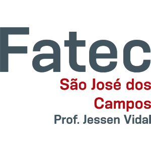

# Carlos Neto |    

Atua no cargo de Programador Júnior Nível 2 na empresa Fotosensores Tecnologia Eletrônica LTDA (Mobilidade Urbana). Suas principais atividades são: 

- Desenvolvimento, criação de bibliotecas e testes com Python;
- Preparação de ambientes de produção com Docker Compose, criação e otimização de imagens Docker e provisionamento com Ansible;
- Integração de sistemas através de API com FastAPI e Flask;
- Configuração de entrada, filtro/transformação e saída de logs com Fluent Bit, Rsyslog, Redis e Graylog;
- Mensageria entre microserviços com RabbitMQ, Redis e ZeroMQ;
- Empacotamento de softwares para o formato RPM;
- Criação e padronização de rotinas CI/CD com o Gitlab;
- Documentação de código fonte e projetos com Markdown e Sphinx, com acesso via GitLab Pages;
- Estudos técnicos com base nas regras de negócio da empresa;
- Configuração de Proxy Reverso e ambiente Web seguro, através do NGINX com SSL/TLS.

## Especialidades :nerd_face:	

- Python;
- Ansible;
- Docker;
- GNU/Linux;
- IaC;
- DevOps.

## Formação :man_student:	

<table>
    <thead>
        <tr>
            <th rowspan="3">
                
            </th>
            <th>GitLab Certified Associate</th>
        </tr>
        <tr>
            <td>Gitlab</td>
        </tr>
        <tr>
            <td>Concluído em Maio de 2021</td>
        </tr>
    </thead>
</table>

---

<table>
    <thead>
        <tr>
            <th rowspan="3">
                
            </th>
            <th>Tecnólogo em Análise e Desenvolvimento de Sistemas</th>
        </tr>
        <tr>
            <td>FATEC São José dos Campos - Prof. Jessen Vidal</td>
        </tr>
        <tr>
            <td>Concluído em Julho 2019</td>
        </tr>
    </thead>
</table>

--- 

<table>
    <thead>
        <tr>
            <th rowspan="3">
                
            </th>
            <th>Técnico em Redes de Computadores</th>
        </tr>
        <tr>
            <td>ETEC Cônego José Bento</td>
        </tr>
        <tr>
            <td>Concluído em Julho 2017</td>
        </tr>
    </thead>
</table>

---

<table>
    <thead>
        <tr>
            <th rowspan="3">
                
            </th>
            <th>Técnico em Automação Industrial</th>
        </tr>
        <tr>
            <td>ITJ - Instituto de Tecnologia de Jacareí</td>
        </tr>
        <tr>
            <td>Concluído em Dezembro 2015</td>
        </tr>
    </thead>
</table>

---

## Leituras :open_book:

- [Python Fluente: Programação Clara, Concisa e Eficaz - Luciano Ramalho](https://www.amazon.com.br/Python-Fluente-Programa%C3%A7%C3%A3o-Concisa-Eficaz/dp/857522462X#:~:text=O%20autor%20Luciano%20Ramalho%20apresenta,mais%20leg%C3%ADvel%20ao%20mesmo%20tempo.)
- [Python Cookiebook - David Beazley,
Brian K. Jones](https://books.google.com.br/books/about/Python_Cookbook.html?id=yhfdQgq8JF4C&redir_esc=y)
- [O Guia do Mochileiro Python: Melhores práticas para desenvolvimento - Tanya Schlusser, Kenneth Reitz](https://www.amazon.com.br/Guia-Mochileiro-Python-Melhores-desenvolvimento-ebook/dp/B07QMY2VPL)

---

> Última Alteração: 20/05/2021
